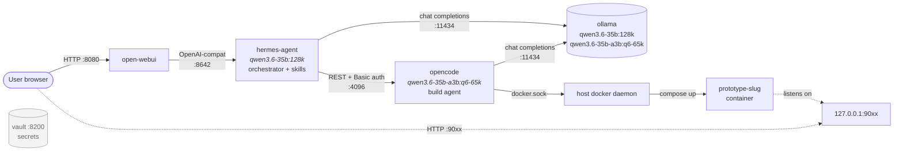
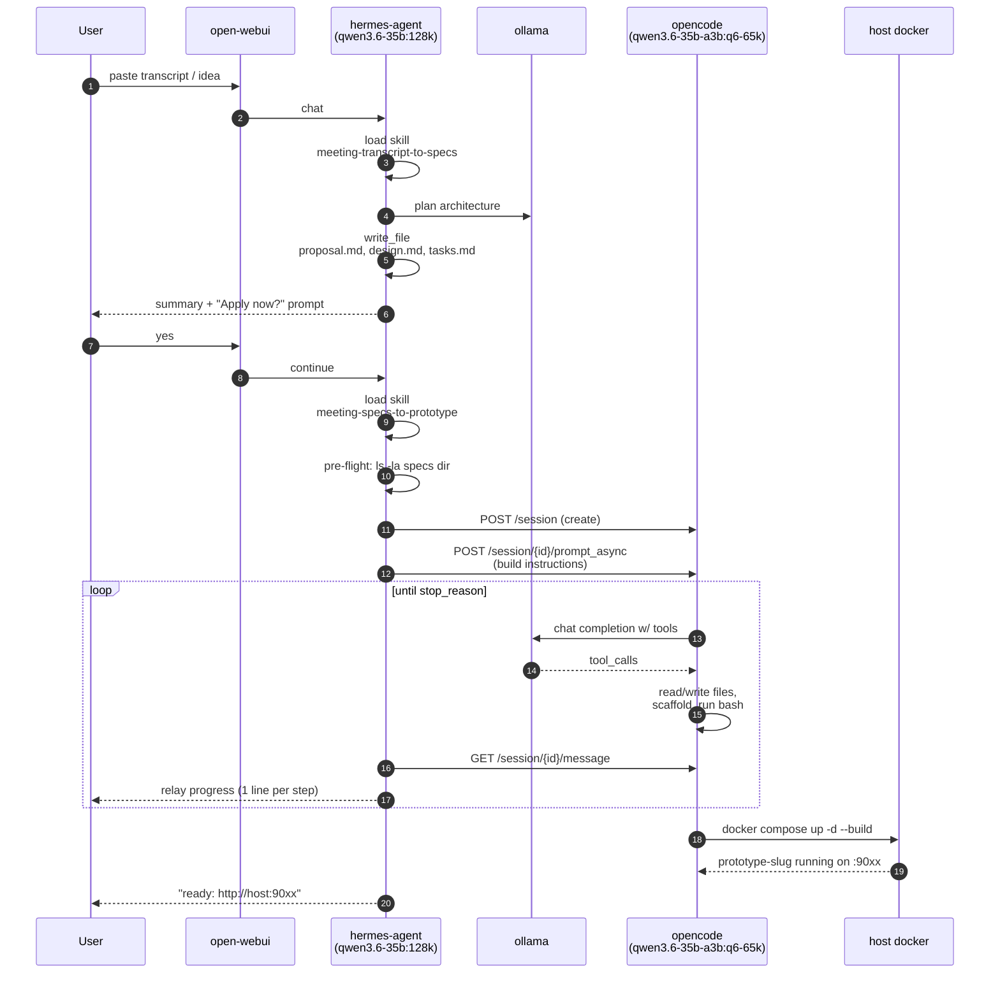

# Hermes Architecture — Meeting Transcript → Working Prototype

A meeting transcript (or a rough idea pasted into chat) is turned into a **running, containerized prototype reachable at `http://<host>:90xx`** by chaining two local LLM agents on a single GPU host. The user only ever talks to the chat UI; spec authoring, code scaffolding, image build, port allocation, and container launch are all autonomous. Nothing leaves the box — `qwen3.6-35b:128k` plans, `qwen3.6-35b-a3b:q6-65k` implements, both served by a local Ollama.

## Topology

All inter-container traffic is on the `hermes-config_default` Docker network; services reach each other by name (`ollama:11434`, `opencode:4096`, `hermes-agent:8642`).

## Pipeline: transcript → spec → prototype

## Models

| Model | Role | VRAM | Context | Notes |
|---|---|---|---|---|
| `qwen3.6-35b:128k` | Hermes orchestrator — user dialog, skill execution, planning | ~43 GB | 131K | Qwen3.6-35B-A3B Q8_0 (MoE, 3B active); pinned via `OLLAMA_KEEP_ALIVE=-1` |
| `qwen3.6-35b-a3b:q6-65k` | OpenCode build agent — code, file ops, container builds | ~32 GB | 65K | Qwen3.6-35B-A3B Q6_K GGUF (bartowski); retrofitted with `PARSER qwen3.5` + `RENDERER qwen3.5` for `tools` capability |

Total resident at idle: ~75 GB. KV cache fills during active builds (peak ~100 GB estimated) on the 128 GB GB10.

### Modelfile `PARSER`/`RENDERER` contract

The `tools` capability on an Ollama tag is derived from its Modelfile's `PARSER` directive — not from GGUF metadata. Custom HuggingFace GGUFs registered with a bare `TEMPLATE {{ .Prompt }}` and no `PARSER` silently fail to expose `tools`, breaking opencode's agentic build loop even though the underlying weights are tool-capable. Both Modelfiles in this repo (`Modelfile.qwen3.6-35b-a3b-q6-65k` and `Modelfile.hermes4-70b-131k`) declare an explicit parser; verify with `docker exec ollama ollama show <tag>` after registration — the `Capabilities` block must list `tools`. The `qwen3.5` parser handles the whole Qwen3.x MoE family (architecture `qwen35moe`) including A3B variants and structures `thinking`/`tool_calls` into separate response fields, so the older `<think>...</think>` scraping path is not needed when this parser is in use.

## Network reference

| Service | Host port | Bound to | Auth | Purpose |
|---|---|---|---|---|
| open-webui | 8080 | `0.0.0.0` | OWUI sessions | Chat UI |
| hermes-agent | 8642 | `127.0.0.1` | API key | OpenAI-compat gateway used by Open WebUI |
| ollama | 11434 | `127.0.0.1` | none (loopback) | Model server |
| opencode | 4096 | `127.0.0.1` | HTTP Basic | Build-agent REST (sessions, prompts, events) |
| vault | 8200 | `127.0.0.1` | dev token | Secrets (not in transcript flow today) |
| prototypes | 9000–9099 | `127.0.0.1` | per-prototype | Pool allocated by `prototypes/.registry/allocate-port.sh` |

## Key paths (host ↔ container)

| Host | Container path | Mounted into | Role |
|---|---|---|---|
| `~/.hermes/` | `/opt/data` (`HERMES_HOME`) | hermes-agent | Skills (`/opt/data/skills`), bundled-skill manifest, memory |
| `./prototypes/` | `/prototypes` | opencode | Spec workspace + build output (visible to both containers) |
| `./prototypes/` | `/home/admin/code/hermes-config/prototypes/` | hermes-agent | Same files, longer prefix (Hermes uses absolute host path) |
| `./prototype-specs/` | `/specs:ro` | opencode | Read-only spec inputs |
| `/var/run/docker.sock` | `/var/run/docker.sock` | opencode | So the build agent can `docker compose up` the prototype |

Path translation matters: in OpenCode-bound payloads use the short `/prototypes/...` form; in Hermes-side terminal commands use the full `/home/admin/code/hermes-config/prototypes/...` form.

## Skill chain

Two skills under `software-development/` execute the pipeline:

1. **`meeting-transcript-to-specs`** *(Hermes only)*
   Acts as a Staff-Level Architect. Extracts features and flows from the transcript, enforces an air-gapped/local-first architecture (rejects cloud SaaS deps), declares a container base image and internal port, and writes `proposal.md` + `design.md` + `tasks.md` to `prototypes/<project>/openspec/changes/<feature>/`. Ends by asking the user: apply now, edit specs, or stop.

2. **`meeting-specs-to-prototype`** *(Hermes → OpenCode)*
   Hermes does **not** implement the prototype itself — it hands off the change directory to the OpenCode build agent via a REST session, then polls and relays progress. The build agent: reads the three spec files, scaffolds source, writes a per-prototype `Dockerfile` + `docker-compose.yml`, allocates a port from the 9000–9099 pool, builds the image (`prototype-<slug>:latest`, never pushed), and brings up the container with `restart: unless-stopped` and named volumes for state. End state: `127.0.0.1:90xx` serving the demo, with the change directory archived to `openspec/archive/<feature>/`.

Skills load on-demand via `skill_view` from `$HERMES_HOME/skills/`; the bundled-vs-user state is reconciled by `hermes-agent/tools/skills_sync.py` against an MD5 manifest at `~/.hermes/skills/.bundled_manifest`.

## Where to look

| File | Role |
|---|---|
| `docker-compose.yml` | Service stack, env vars, ports, mounts |
| `opencode/opencode.json` | OpenCode model registry + default model selection (baked into image at build) |
| `opencode/AGENTS.md` | Build-agent system prompt (note: bind-mount can shadow at runtime) |
| `hermes-agent/skills/software-development/meeting-transcript-to-specs/SKILL.md` | Propose-phase skill source |
| `hermes-agent/skills/software-development/meeting-specs-to-prototype/SKILL.md` | Apply-phase skill source |
| `~/.hermes/skills/...SKILL.md` | Runtime skill copies Hermes actually loads |
| `prototypes/.registry/allocate-port.sh` | Idempotent flock-protected port allocator |
| `.env` / `.env.example` | `HERMES_API_KEY`, `OPENCODE_PASSWORD`, `HOME_ASSISTANT_*`, etc. |
