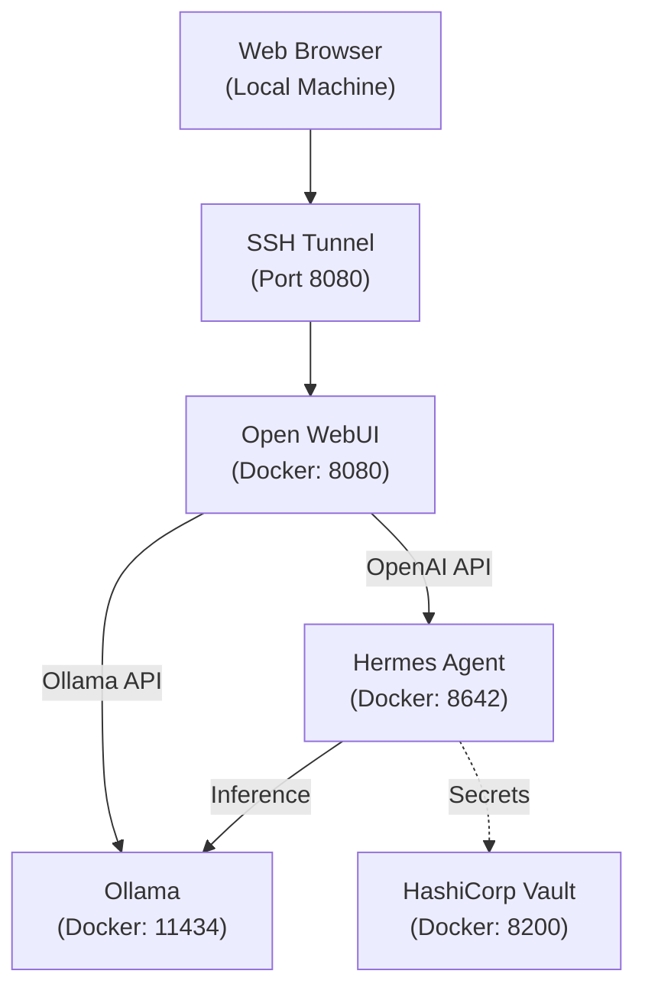

# Hermes Agent + Open WebUI + Ollama Deployment

This document describes the current deployment of Hermes Agent, integrated with Open WebUI as a frontend, Ollama as the local inference backend, and HashiCorp Vault for secret management.

## Architecture



## Service Details

### 1. Ollama
- **Container Name**: `ollama`
- **Image**: `ollama/ollama:latest`
- **Port**: `11434`
- **Orchestrator model**: `qwen3.6-35b:128k` (Qwen3.6-35B-A3B Q8_0, 131K context) — used by `hermes-agent`.
- **Coder model**: `qwen3.6-35b-a3b:q6-65k` (Qwen3.6-35B-A3B Q6_K, 65K context) — used by `opencode`.
- **Role**: Provides the base LLM inference. Optimized for NVIDIA GPUs with `OLLAMA_FLASH_ATTENTION=1`, `OLLAMA_KV_CACHE_TYPE=q8_0`, `OLLAMA_KEEP_ALIVE=-1` (models stay resident), and `OLLAMA_CONTEXT_LENGTH=131072` (server default; per-Modelfile `num_ctx` overrides).

#### Modelfile contract — tools capability for custom GGUFs

Ollama infers the `tools` capability from the Modelfile's `PARSER` directive, not from the GGUF itself. If you register a custom HuggingFace GGUF (`FROM hf.co/...`) without declaring a parser, the resulting tag silently omits `tools` from its capability list — tool-calls will never fire even though the underlying weights support them. Both the orchestrator and coder Modelfiles therefore declare:

```modelfile
TEMPLATE {{ .Prompt }}
RENDERER qwen3.5
PARSER qwen3.5
```

After registration, verify with `docker exec ollama ollama show <tag>` — the `Capabilities` block must list `tools`. If it doesn't, tool-calling downstream (hermes-agent skills, opencode build agent) will be a silent no-op.

### 2. Hermes Agent
- **Container Name**: `hermes-agent`
- **Image**: `hermes-agent:latest` (built from `./hermes-agent`)
- **Port**: `8642`
- **Role**: An "agentic" wrapper around the LLM. Manages tool execution (terminal, file system, web search) and sessions.
- **Backend**: Connected to Ollama via `http://ollama:11434/v1`.
- **API Server**: Enabled with key `change-me-to-something-secure`.

### 3. Open WebUI
- **Container Name**: `open-webui`
- **Image**: `ghcr.io/open-webui/open-webui:main`
- **Port**: `8080`
- **Role**: The primary user interface.
- **Connections**: 
    - **Hermes Agent**: Added as an OpenAI provider at `http://hermes-agent:8642/v1`.
    - **Ollama**: Added as an Ollama provider at `http://ollama:11434`.

### 4. HashiCorp Vault
- **Container Name**: `vault`
- **Image**: `hashicorp/vault`
- **Port**: `8200`
- **Role**: Secure storage for sensitive API keys and credentials.
- **Status**: Currently running in Dev Mode with `VAULT_DEV_ROOT_TOKEN_ID=root`.

---

## Network Configuration

All services are deployed within the same Docker network (default bridge). They communicate using internal Docker DNS:

| Source | Destination | Protocol | Internal URL |
|--------|-------------|----------|--------------|
| Open WebUI | Hermes Agent | HTTP | `http://hermes-agent:8642` |
| Open WebUI | Ollama | HTTP | `http://ollama:11434` |
| Hermes Agent | Ollama | HTTP | `http://ollama:11434` |
| Hermes Agent | Vault | HTTP | `http://vault:8200` |

---

## Vault Setup & Secrets Management

Secrets are managed via Vault. To initialize Vault with the required secrets (Home Assistant, Brave Search, etc.), run the bootstrap script:

```bash
./setup_vault.sh
```

This script will:
1. Start the Vault container if it's not already running.
2. Read secrets from your local `.env` file.
3. Inject them into Vault at the path `secret/gemini-cli`.

### Manual Secret Access
You can verify secrets inside the container:
```bash
docker exec -it vault vault kv get secret/gemini-cli
```

---

## Accessing the UI over SSH

To access the interface from your local machine, use SSH port forwarding:

```bash
# Run this on your LOCAL computer
ssh -L 8080:localhost:8080 user@remote-ip
```

Then visit **[http://localhost:8080](http://localhost:8080)** in your browser.

> **Note**: If you get an `ERR_SSL_PROTOCOL_ERROR`, ensure you are using `http://` and not `https://`. Using `http://127.0.0.1:8080` instead of `localhost` can also help bypass browser-forced HTTPS.

## Troubleshooting

### Build agent silently queues but never executes

Symptom: `opencode` accepts a `/session/<id>/prompt_async` POST but polling `/session/<id>/message` returns 0 assistant parts indefinitely; `docker logs opencode` is empty; `ollama ps` shows the coder model never loaded.

Cause: the coder model advertises no `tools` capability, so OpenCode has nothing to emit. This happens most often after registering a custom GGUF without a `PARSER` directive (see the Modelfile contract above).

Fix:
```bash
docker exec ollama ollama show <coder-tag> | grep -A3 Capabilities
# If `tools` is absent, re-register the tag with PARSER/RENDERER directives.
# The existing blob can be reused — point FROM at /root/.ollama/models/blobs/sha256-<hash>
# and add the PARSER line. No re-download.
```

### No models in dropdown
1. Check the **Admin Settings > Connections** in Open WebUI.
2. Verify the **OpenAI API** URL is `http://hermes-agent:8642/v1` and the key is `change-me-to-something-secure`.
3. Verify the **Ollama API** URL is `http://ollama:11434`.

### Resetting Password
If you forget your admin password, you can reset it via the database inside the container:
```bash
docker exec -it open-webui python3 -c "import bcrypt; import sqlite3; password = b'NEW_PASSWORD'; salt = bcrypt.gensalt(); hashed = bcrypt.hashpw(password, salt).decode(); conn = sqlite3.connect('/app/backend/data/webui.db'); cursor = conn.cursor(); cursor.execute('UPDATE auth SET password = ? WHERE email = ?', (hashed, 'YOUR_EMAIL')); conn.commit(); print('Success')"
```
