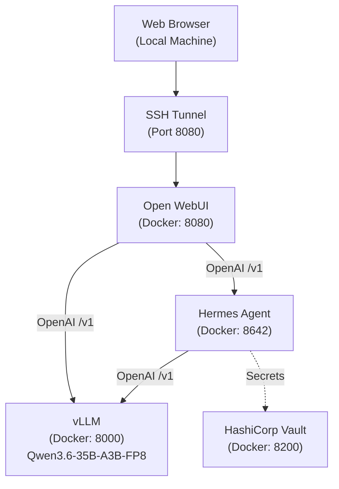

# Hermes Agent + Open WebUI + vLLM Deployment

This document describes the current deployment of Hermes Agent, integrated with Open WebUI as a frontend, vLLM as the local inference backend, and HashiCorp Vault for secret management.

> Migrated from Ollama → vLLM on 2026-04-25. The previous Ollama Modelfiles are archived under `legacy-modelfiles/`. The `ollama_data` Docker volume is intentionally preserved (orphaned) for one-week rollback.

## Architecture



## Service Details

### 1. vLLM
- **Container Name**: `vllm`
- **Image**: `scitrera/dgx-spark-vllm:0.14.1-t4` (vLLM 0.14.1 + Transformers 4.57.6 + PyTorch 2.10.0 + CUDA 13.1.0 + FlashInfer 0.6.2, pre-built for ARM64 + GB10 Blackwell SM_120). The vanilla `vllm/vllm-openai` image is x86_64 only and **will not work** on DGX Spark.
- **Port**: `8000` inside the container; published on the host as `0.0.0.0:8001:8000` (host port 8001 because 8000 is held by an unrelated prototype). Inter-container URL is `http://vllm:8000/v1`; from the DGX host use `http://127.0.0.1:8001/v1`; from the LAN use `http://192.168.10.80:8001/v1`. **vLLM has no built-in auth** — the LAN bind implicitly trusts the LAN. To gate it, switch the publish back to `127.0.0.1:8001:8000` and front it with the existing openclaw Caddy (which already terminates TLS on `192.168.10.80:443`).
- **Model served**: `Qwen/Qwen3.6-35B-A3B-FP8` — the official Qwen build with BF16 + F8_E4M3 safetensors, MoE (256 experts, 8 routed + 1 shared per token). Hits the GB10 FP8 tensor cores natively.
- **Multi-aliased served-model-name**: `qwen3.6-35b:128k`, `qwen3.6:35b-a3b-q8_0`, `qwen3.6-35b-a3b:q6-65k`, `hermes-orchestrator:qwen3.6-128k` — every name existing clients send resolves to the same backend, so `LLM_MODEL` env vars and provider configs did not need to change at the model level.
- **First boot**: downloads ~37 GB from HuggingFace and compiles CUDA graphs. Plan for **8–15 minutes** before `/health` returns 200. The compose healthcheck uses `start_period: 900s` to cover this.

#### vLLM serve flags — what each one buys you

| Flag | Why |
|------|-----|
| `--max-model-len 131072` | Matches the prior Ollama `OLLAMA_CONTEXT_LENGTH`. Qwen3.6 supports 262K natively (1M with YaRN); raise this if you want more. |
| `--gpu-memory-utilization 0.75` | DGX Spark's 128 GB is **unified memory** shared with the Grace CPU, OS, and any other containers. The vLLM default of 0.9 overcommits; 0.75 (~91 GB target) is the right setting when no other heavy GPU workloads are loaded. If you boot ComfyUI or another container that holds tens of GB resident, vllm will crash-loop with `ValueError: Free memory on device cuda:0 (X/121.69 GiB) on startup is less than desired GPU memory utilization` — either stop the other container, or drop this to 0.55 + `--max-model-len 32768`. |
| `--reasoning-parser qwen3` | Splits `<think>...</think>` into the OpenAI `reasoning_content` field cleanly. |
| `--enable-auto-tool-choice` | Required when any client sends `tool_choice: "auto"` (hermes-agent, opencode, OpenClaw all do). |
| `--tool-call-parser qwen3_coder` | **Critical.** The `hermes` parser returns HTTP 400 on `tool_choice=auto` for this model family — see NVIDIA forum thread `362784` ("vLLM returns 400 error for tool_choice='auto' when called from OpenClaw (Qwen3.5-35B on NVIDIA Spark GB10)"). Qwen's HF model card explicitly specifies `qwen3_coder`. |
| `--language-model-only` | Qwen3.6-35B-A3B-FP8 ships with a vision encoder that we don't use. Skipping saves ~3 GB and startup time. |

#### Tool-calling sanity check after deploy

```bash
curl -s http://127.0.0.1:8001/v1/chat/completions \
  -H "Content-Type: application/json" \
  -d '{
    "model":"qwen3.6-35b:128k",
    "messages":[{"role":"user","content":"What is the weather in Paris?"}],
    "tools":[{"type":"function","function":{"name":"get_weather","parameters":{"type":"object","properties":{"city":{"type":"string"}}}}}],
    "tool_choice":"auto"
  }' | jq '.choices[0].message.tool_calls'
```

Must return a non-null `tool_calls` array. If it returns raw text or a 400, the parser flag is wrong.

### 2. Hermes Agent
- **Container Name**: `hermes-agent`
- **Image**: `hermes-agent:latest` (built from `./hermes-agent`)
- **Port**: `8642`
- **Role**: An "agentic" wrapper around the LLM. Manages tool execution (terminal, file system, web search) and sessions.
- **Backend**: Connected to vLLM via `http://vllm:8000/v1`.
- **API Server**: Enabled with key from `HERMES_API_KEY` env var.

### 3. Open WebUI
- **Container Name**: `open-webui`
- **Image**: `ghcr.io/open-webui/open-webui:main`
- **Port**: `8080`
- **Role**: The primary user interface.
- **Connections** (multi-URL OpenAI provider form via `OPENAI_API_BASE_URLS=...;...`):
    - **Hermes Agent** at `http://hermes-agent:8642/v1` (orchestrated chats with tools, memory, skills).
    - **vLLM** at `http://vllm:8000/v1` (raw model access, no orchestration).
- The previous `OLLAMA_BASE_URL` provider was dropped — vLLM does not implement Ollama-native `/api/*`. If you miss the Ollama-side dropdown, that capability is gone (one-way door).

### 4. HashiCorp Vault
- **Container Name**: `vault`
- **Image**: `hashicorp/vault`
- **Port**: `8200`
- **Role**: Secure storage for sensitive API keys and credentials.
- **Status**: Currently running in Dev Mode with `VAULT_DEV_ROOT_TOKEN_ID=root`.

---

## Network Configuration

All services are deployed within the same Docker network (default bridge). They communicate using internal Docker DNS:

| Source | Destination | Protocol | Internal URL |
|--------|-------------|----------|--------------|
| Open WebUI | Hermes Agent | HTTP | `http://hermes-agent:8642/v1` |
| Open WebUI | vLLM | HTTP | `http://vllm:8000/v1` |
| Hermes Agent | vLLM | HTTP | `http://vllm:8000/v1` |
| OpenCode | vLLM | HTTP | `http://vllm:8000/v1` |
| OpenClaw (sibling stack) | vLLM | HTTP | `http://vllm:8000/v1` (via `openclaw-ollama-proxy` socat sidecar on `127.0.0.1:18791`, which now forwards to `vllm:8000` rather than `ollama:11434`) |
| Hermes Agent | Vault | HTTP | `http://vault:8200` |

---

## Vault Setup & Secrets Management

Secrets are managed via Vault. To initialize Vault with the required secrets (Home Assistant, Brave Search, etc.), run the bootstrap script:

```bash
./setup_vault.sh
```

This script will:
1. Start the Vault container if it's not already running.
2. Read secrets from your local `.env` file.
3. Inject them into Vault at the path `secret/gemini-cli`.

### Manual Secret Access
You can verify secrets inside the container:
```bash
docker exec -it vault vault kv get secret/gemini-cli
```

---

## Accessing the UI over SSH

To access the interface from your local machine, use SSH port forwarding:

```bash
# Run this on your LOCAL computer
ssh -L 8080:localhost:8080 user@remote-ip
```

Then visit **[http://localhost:8080](http://localhost:8080)** in your browser.

> **Note**: If you get an `ERR_SSL_PROTOCOL_ERROR`, ensure you are using `http://` and not `https://`. Using `http://127.0.0.1:8080` instead of `localhost` can also help bypass browser-forced HTTPS.

## Backup & Restore

Off-host backups go to **Backblaze B2** via **restic** (client-side encrypted, deduplicated). Established 2026-05-03; first full snapshot landed `4d0c29d8`.

### What's where

| | |
|---|---|
| Tool | `restic` 0.18.1 at `/usr/local/bin/restic` (installed by `scripts/install-restic.sh`) |
| Repo | `b2:tharpe-dgx-spark:dgx-spark` (Backblaze B2, private bucket, SSE-B2, lifecycle "keep only the last version") |
| Credentials | `.env.backup` (gitignored, mode 600) — `B2_ACCOUNT_ID`, `B2_ACCOUNT_KEY`, `B2_BUCKET`, `RESTIC_REPOSITORY`, `RESTIC_PASSWORD` |
| Sudo grant | `/etc/sudoers.d/restic-backup` — `admin ALL=(root) NOPASSWD: SETENV: /usr/local/bin/restic` |
| Excludes | `scripts/excludes.txt` — system pseudo-fs, regenerable caches, build artifacts |
| Log | `.backup.log` (admin-owned, append-only) |

The restic password is **not recoverable** if lost — Backblaze cannot decrypt the repo. Keep at minimum two offline copies (password manager + paper/USB).

### Source paths covered

`/home`, `/etc`, `/usr/local`, `/root`, `/var/lib/docker/volumes` — everything stateful. Docker image/layer storage (`/var/lib/docker/{overlay2,containers,image,...}`) is excluded since images come from registries and ephemeral state isn't data.

### Schedule

Three systemd timers, installed by `scripts/install-backup-timers.sh`. Verify with `systemctl list-timers 'hermes-backup*'`.

| Timer | When | Service |
|---|---|---|
| `hermes-backup.timer` | daily 03:00 UTC | full incremental snapshot |
| `hermes-backup-check.timer` | weekly Sun 04:00 UTC | `restic check --read-data-subset=5%` |
| `hermes-backup-prune.timer` | monthly 1st 05:00 UTC | `restic forget --keep-daily 14 --keep-weekly 8 --keep-monthly 12 --keep-yearly 3 --prune` |

All `Persistent=true` so missed firings catch up on next boot.

### Restoring

Use `scripts/restore.sh`:

```bash
scripts/restore.sh list                              # list snapshots
scripts/restore.sh list <snap-id>                    # list files in a snapshot
scripts/restore.sh file <abs-path> [snap]            # → /tmp/restic-restore-<ts>/<path>
scripts/restore.sh volume <docker-vol-name> [snap]   # restore in place; prompts
scripts/restore.sh system [snap]                     # full restore to / ; YES gate
```

`snap` defaults to `latest`. The wrapper handles the B2 cold-connection retry pattern (first attempt often hits `context deadline exceeded`; retries usually succeed on attempt 2).

**Bare-metal recovery on a fresh DGX Spark:**

1. Stock OS install + nvidia drivers (`bootstrap.sh`)
2. `git clone <hermes-config-remote> ~/code/hermes-config`
3. Drop B2 creds + `RESTIC_PASSWORD` into `~/code/hermes-config/.env.backup` (the only thing not recoverable from git; comes from your password manager)
4. `bash ~/code/hermes-config/scripts/install-restic.sh`
5. Add the sudoers entry: `echo 'admin ALL=(root) NOPASSWD: SETENV: /usr/local/bin/restic' | sudo tee /etc/sudoers.d/restic-backup && sudo chmod 440 /etc/sudoers.d/restic-backup`
6. `bash ~/code/hermes-config/scripts/restore.sh system`
7. Reboot, then `bash ~/code/hermes-config/scripts/install-backup-timers.sh` to re-arm the schedule

The repo + four credential values are sufficient to fully reconstitute the host.

### Manual ops

```bash
# ad-hoc backup (same logic as the daily timer)
scripts/backup.sh
scripts/backup.sh --dry-run                          # estimate-only

# inspect
. .env.backup && restic --no-lock snapshots
. .env.backup && restic --no-lock stats --mode raw-data

# rotate the B2 application key
# 1) generate a new app key in the B2 console (scoped to this bucket)
# 2) update B2_ACCOUNT_ID + B2_ACCOUNT_KEY in .env.backup
# 3) delete the old key in the B2 console
```

## Troubleshooting

### Build agent silently queues but never executes

Symptom: `opencode` accepts a `/session/<id>/prompt_async` POST but polling `/session/<id>/message` returns 0 assistant parts indefinitely.

Cause under vLLM: the wrong `--tool-call-parser` is set on the `vllm` container. With `hermes` (the obvious-but-wrong choice for this model family), tool-calls return raw text instead of structured `tool_calls` and OpenCode has nothing to dispatch.

Fix:
```bash
docker exec vllm sh -c 'ps -o args -p 1' | grep -o -- '--tool-call-parser[= ][^ ]*'
# Must report: --tool-call-parser=qwen3_coder
# If it reports `hermes`, edit docker-compose.yml and `docker compose up -d vllm`.
```

Sanity-check the tool-call surface end-to-end with the curl from the vLLM service section above.

### No models in dropdown
1. Check the **Admin Settings > Connections** in Open WebUI.
2. Verify the **OpenAI API** URLs are `http://hermes-agent:8642/v1` (key = `HERMES_API_KEY`) AND `http://vllm:8000/v1` (key = `none`). Open WebUI accepts both via the `OPENAI_API_BASE_URLS` semicolon-separated form.
3. `curl http://127.0.0.1:8001/v1/models | jq '.data[].id'` should list all four served-model-name aliases.

### Resetting Password
If you forget your admin password, you can reset it via the database inside the container:
```bash
docker exec -it open-webui python3 -c "import bcrypt; import sqlite3; password = b'NEW_PASSWORD'; salt = bcrypt.gensalt(); hashed = bcrypt.hashpw(password, salt).decode(); conn = sqlite3.connect('/app/backend/data/webui.db'); cursor = conn.cursor(); cursor.execute('UPDATE auth SET password = ? WHERE email = ?', (hashed, 'YOUR_EMAIL')); conn.commit(); print('Success')"
```
