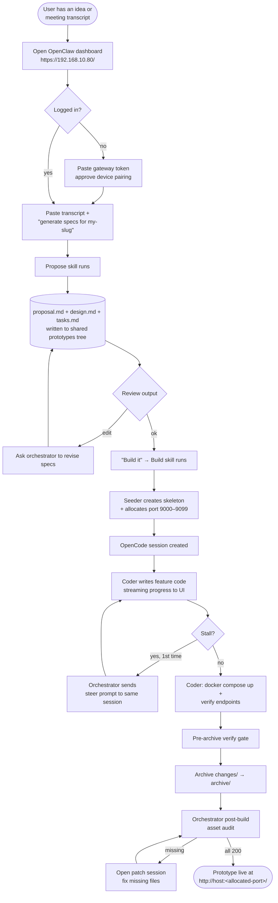
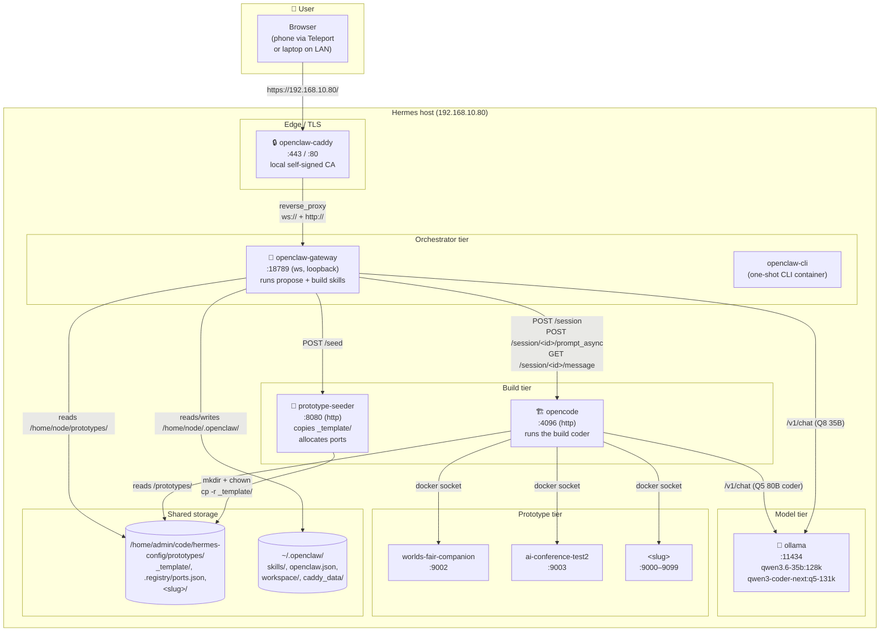
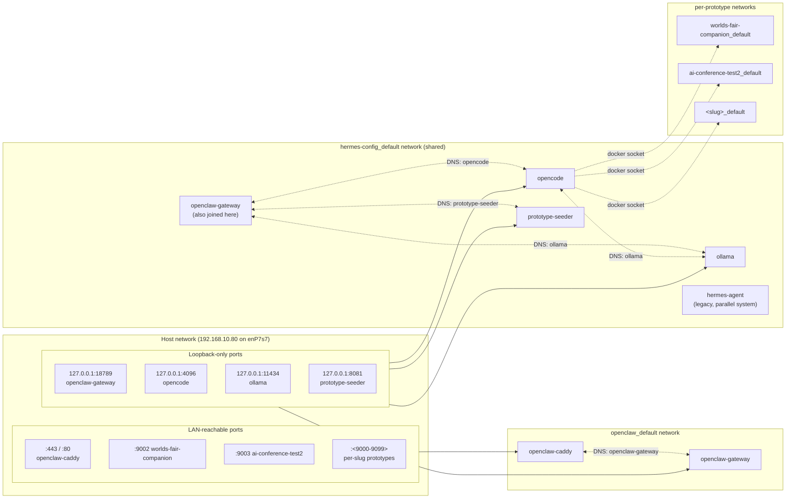
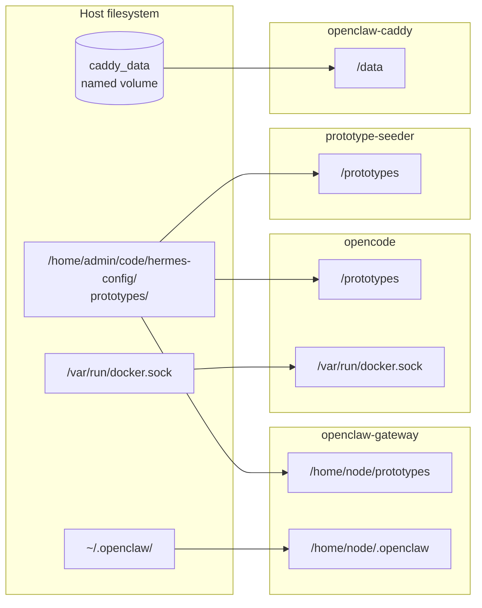

# Meeting Transcript → Prototype

End-to-end reference for the two-skill pipeline that turns a raw meeting transcript (or idea) into a running, browsable prototype on a local port. Runs entirely air-gapped on the Hermes host — no cloud services involved.

**Two skills, two models, one orchestrator:**

| Skill | Model | Role |
|---|---|---|
| `meeting-transcript-to-specs` | `qwen3.6-35b:128k` (Q8, 131k ctx) | Propose phase — writes `proposal.md` / `design.md` / `tasks.md` |
| `meeting-specs-to-prototype` | `qwen3-coder-next:q5-131k` (Q5, 131k ctx) | Build phase — OpenCode coder writes the actual code |

---

## 1. User flow



---

## 2. Component view (C4-ish)



**Key fact about tiers:** `openclaw-gateway` never runs Docker itself — it speaks HTTP to `opencode`, which has the docker socket mounted and starts/manages prototype containers on the host.

---

## 3. Sequence diagram — happy path

```mermaid
sequenceDiagram
    autonumber
    participant U as User
    participant B as Browser
    participant C as openclaw-caddy
    participant G as openclaw-gateway<br/>(orchestrator, Q8 35B)
    participant M as ollama
    participant S as prototype-seeder
    participant O as opencode<br/>(coder, Q5 80B)
    participant P as Prototype container

    Note over U,B: Phase 0 — User logs in
    U->>B: https://192.168.10.80/#token=...
    B->>C: TLS handshake (local CA)
    C->>G: ws:// upgrade
    G-->>B: dashboard ready
    U->>B: paste transcript + slug

    Note over G,M: Phase 1 — Propose
    B->>G: chat message (transcript)
    G->>M: /v1/chat (qwen3.6-35b:128k)
    M-->>G: writes proposal.md<br/>design.md, tasks.md
    Note right of G: files land at<br/>/home/node/prototypes/&lt;slug&gt;/openspec/changes/prototype/
    G-->>B: "specs ready; build?"
    U->>B: "yes, build"

    Note over G,S: Phase 2 — Seed skeleton
    B->>G: build trigger
    G->>G: ls specs dir (verify 3 files)
    G->>S: POST /seed {slug}
    S->>S: cp -r _template/ <slug>/<br/>allocate port (9000–9099)<br/>chown root:root
    S-->>G: {port, path}

    Note over G,O: Phase 3 — Hand off to OpenCode
    G->>O: POST /session {title}
    O-->>G: {id: ses_…}
    G->>G: write /tmp/opencode_prompt.txt<br/>(build prompt w/ WRAPPER CONTRACT)
    G->>G: build-payload.sh → /tmp/opencode_payload.json
    G->>O: POST /session/<id>/prompt_async
    O-->>G: 204 No Content (async)

    Note over G,P: Phase 4 — Build (background on opencode)
    loop coder tool rounds (30s–4min each)
        O->>M: /v1/chat (qwen3-coder-next:q5-131k)
        M-->>O: tool calls
        O->>O: write/edit src/server/*, src/frontend/*<br/>seed.py, schema.sql
    end
    O->>P: docker compose up -d --build<br/>(via host docker socket)
    P-->>O: container healthy
    loop verify endpoints
        O->>P: docker exec curl localhost:8000/api/...
        P-->>O: 200
    end

    Note over O: Task 4.5 — pre-archive verify gate
    O->>P: curl every /static/… URL<br/>grep schema.sql vs seed.py columns
    P-->>O: all green
    O->>O: mv changes/prototype → archive/prototype
    O->>O: emit final text + step-finish stop

    Note over G,O: Phase 5 — Orchestrator polls & audits
    loop every 30s
        G->>O: GET /session/<id>/message
        O-->>G: {terminal, part_count, latest_text}
        G-->>B: relay latest text
    end
    G->>P: docker exec curl /static/… (post-build audit)
    P-->>G: all 200
    G-->>B: "prototype live at http://host:<port>/"
    U->>B: visit http://192.168.10.80:<port>/
    B->>P: GET / (directly, not through Caddy)
    P-->>B: index.html + /static/... + /api/...
```

---

## 4. Docker networking



**Rules of the layout**:

- **Caddy is the only thing published on LAN port 443/80** — all other orchestrator ports are loopback-only on the host. Phone traffic: `https://192.168.10.80/` → Caddy → openclaw-gateway over the `openclaw_default` bridge.
- **openclaw-gateway is dual-homed** on both `openclaw_default` (to receive Caddy's proxy) and `hermes-config_default` (to reach ollama/opencode/seeder by hostname).
- **Prototype containers each create their own bridge network** when `docker compose up` runs. They're NOT on the hermes network. OpenCode reaches them only via the host's docker socket (`docker exec` / `docker inspect`), not by hostname — this is why the verify pattern is `docker exec $NAME curl http://localhost:8000/…` from inside the prototype, not `curl http://<slug>:8000/…` from opencode.
- **Prototype ports published on 0.0.0.0** — accessible from LAN (including phone via Teleport) at `http://192.168.10.80:<port>/`.

---

## 5. Filesystem bind-mounts



**Shared-state highlights:**

- `prototypes/` is bind-mounted into three containers — **openclaw-gateway, opencode, seeder all see the same files at their own prefix.** This is what makes the handoff work: the orchestrator writes specs at `/home/node/prototypes/<slug>/...`, the seeder reads those at `/prototypes/<slug>/...`, opencode reads at `/prototypes/<slug>/...`. Same inodes, three paths.
- `~/.openclaw/skills/` is where the two skills (`meeting-transcript-to-specs`, `meeting-specs-to-prototype`) live, user-local, outside any docker build — edit them and restart `openclaw-gateway` to apply.
- `/var/run/docker.sock` into opencode is what lets the coder run `docker compose up -d --build` on the host; openclaw-gateway does NOT have this socket and so cannot run docker itself.

---

## 6. The three critical paths (for debugging)

| Symptom | Where to look |
|---|---|
| "docker: not found" in orchestrator log | Orchestrator tried to build directly. Skill's HARD BOUNDARY section was ignored — re-read to the model, or steer. |
| Coder 404s on `/static/foo.js` | Pre-archive verify gate missed it, or the coder put the file in a subdir. Check `src/frontend/` — URLs are FLAT against that directory. |
| Prototype container crashloops | Usually schema/seed drift — `docker logs <slug>` shows `sqlite3.OperationalError: table X has no column named Y`. Propose-skill's consistency invariant should have caught it. |
| Build session stalls forever | Q5 coder waiting on something. Check `part_count` across polls — if it hasn't moved for 6 polls (~3 min), steer-on-stall fires; if the steered session also stalls, abort is the only option. |
| UI blank / blocked by an overlay | Coder shipped `class="hidden"` without the CSS rule. Template now ships `.hidden { display: none !important; }` in `style.css` — check it wasn't deleted. |

---

## 7. Command cheat sheet

```bash
# Open the dashboard (phone via Teleport, or laptop on LAN)
https://192.168.10.80/#token=<from ~/.openclaw/openclaw.json gateway.auth.token>

# Or generate a pre-auth URL from the CLI
docker compose -f hermes-config/openclaw/docker-compose.yml run --rm openclaw-cli dashboard --no-open

# Approve a device pairing request (first browser / CLI runtime)
docker compose -f hermes-config/openclaw/docker-compose.yml run --rm openclaw-cli devices list
docker compose -f hermes-config/openclaw/docker-compose.yml run --rm openclaw-cli devices approve <request-id>

# Inspect a running build
curl -s -u "$OPENCODE_USERNAME:$OPENCODE_PASSWORD" http://127.0.0.1:4096/session | jq '.[] | select(.title | startswith("build"))'

# Abort a wedged build
curl -s -u "$OPENCODE_USERNAME:$OPENCODE_PASSWORD" -X POST http://127.0.0.1:4096/session/<id>/abort

# Stop a prototype without removing its image/data
docker compose -f /home/admin/code/hermes-config/prototypes/<slug>/docker-compose.yml down

# Fully remove a prototype (container + image + data + port registry entry)
docker compose -f .../<slug>/docker-compose.yml down -v
docker rmi <slug>:latest
sudo rm -rf /home/admin/code/hermes-config/prototypes/<slug>
# also edit /home/admin/code/hermes-config/prototypes/.registry/ports.json
```
