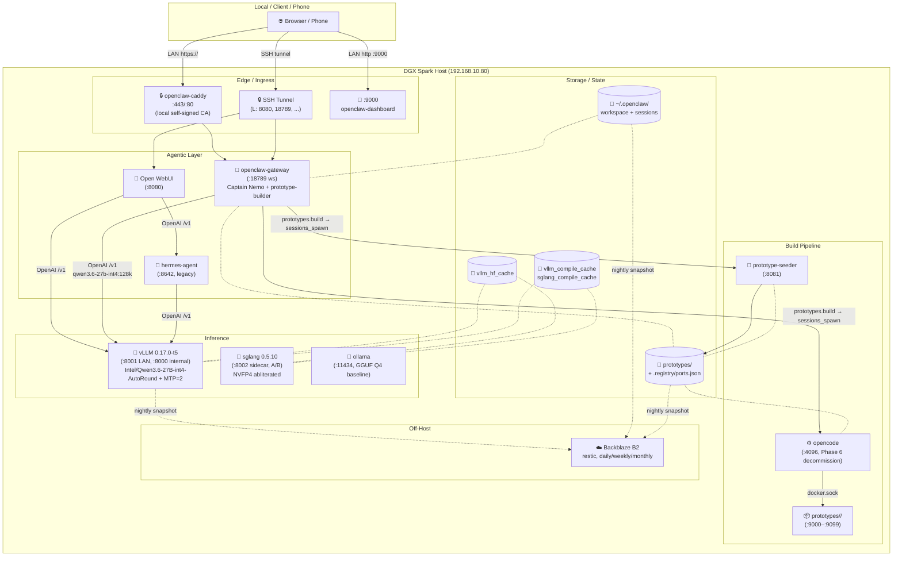

# Hermes / OpenClaw Infrastructure on DGX Spark

Configuration and orchestration for the LLM serving stack on a DGX Spark GB10 (ARM64 + Blackwell SM_120, 128 GB unified memory). One vLLM model serves multiple agentic frontends and a meeting-transcript-to-prototype builder pipeline. Off-host backups via restic to Backblaze B2.

## Architectural Overview



The **primary chat path** is `Browser → openclaw-caddy → openclaw-gateway → vLLM`. Open WebUI + hermes-agent is the **legacy** path, kept around for direct-model chats and Home Assistant tool use. The build pipeline (`prototype-seeder` + `opencode`) is being decommissioned in Phase 6 — the `openclaw-prototypes` plugin and a `prototype-builder` subagent inside the gateway will replace them. See `Specs-To-Build-Handoff.md` for the current build flow.

## Key Systems & Containers

| Service | Port | Image | Description |
| :--- | :--- | :--- | :--- |
| **openclaw-gateway** | `127.0.0.1:18789` (ws) + `0.0.0.0:9000` (dashboard) | `mudrii/openclaw:2026.4.1` | Primary agentic layer. Hosts Captain Nemo (orchestrator) and the `prototype-builder` subagent. |
| **openclaw-dashboard** | `0.0.0.0:9000` | `mudrii/openclaw-dashboard` | Mobile-friendly chat UI. Shares the gateway's netns. |
| **openclaw-caddy** | `0.0.0.0:443/80` | `caddy:2-alpine` | TLS reverse proxy in front of the gateway. Local self-signed CA. |
| **openclaw-cli** | one-shot | (gateway image) | `openclaw agent --agent main --message ...` driver. Used by the eval harness. |
| **vLLM** | `0.0.0.0:8001` → `:8000` | `scitrera/dgx-spark-vllm:0.17.0-t5` | Local LLM inference, ARM64 + GB10 Blackwell. Serves `Intel/Qwen3.6-27B-int4-AutoRound` with MTP=2 speculative decoding under canonical alias `qwen3.6-27b-int4:128k`. |
| **sglang** | `0.0.0.0:8002` → `:30000` | `scitrera/dgx-spark-sglang:0.5.10` | Alternate engine sidecar for cross-engine A/B (eval harness). NVFP4 abliterated 27B with EAGLE spec-decode. Not in the primary chat path. |
| **ollama** | `0.0.0.0:11434` | `ollama/ollama` | GGUF Q4 baseline for the eval harness. Reuses the orphaned `ollama_data` volume from the pre-vLLM cutover. |
| **hermes-agent** | `127.0.0.1:8642` | `hermes-agent:latest` (built locally; gitignored) | Legacy agentic layer. NousResearch upstream + local customizations. Tools, memory, Home Assistant. |
| **Open WebUI** | `0.0.0.0:8080` | `ghcr.io/open-webui/open-webui:main` | Direct-model chat UI. Multi-provider (`hermes-agent` + `vllm`). |
| **opencode** | `127.0.0.1:4096` | `opencode:latest` | Build agent for the legacy meeting-specs-to-prototype path. Phase 6 decommission — being replaced by the in-gateway `prototype-builder`. |
| **prototype-seeder** | `127.0.0.1:8081` | `prototype-seeder:latest` | Copies `prototypes/_template/` into a slug dir, allocates a port from `.registry/ports.json`. Phase 6 decommission — replaced by `prototypes.allocate` in the openclaw-prototypes plugin. |
| **vault** | `127.0.0.1:8200` | `hashicorp/vault` | Dev-mode secret storage for the legacy hermes-agent. |
| **netdata** | `0.0.0.0:19999` | `netdata/netdata` | Lightweight host + container metrics for the LAN. |
| **gbrain** | (no ports — stdio MCP) | `gbrain:latest` (built locally; pinned to `garrytan/gbrain` SHA `c2ae4dbfc58d`) | Personal knowledge brain (additive to Hindsight). Profile-gated (`--profile gbrain`). Brain data at `/home/admin/.gbrain/` ↔ private `bryantharpe/gbrain-data` repo. See `gbrain/README.md`. |

## Ingress

Most ports bind to `127.0.0.1` and require an SSH tunnel from the workstation. **LAN-reachable** exceptions:

- `0.0.0.0:443/80` — openclaw-caddy (primary phone/laptop entry point at `https://192.168.10.80/`)
- `0.0.0.0:9000` — openclaw-dashboard
- `0.0.0.0:8080` — Open WebUI (legacy chat UI)
- `0.0.0.0:8001` — vLLM (no auth — implicitly trusts the LAN)
- `0.0.0.0:8002` — sglang sidecar (same trust model as vLLM)
- `0.0.0.0:11434` — ollama (same trust model)
- `0.0.0.0:19999` — netdata
- `0.0.0.0:9000–9099` — per-prototype apps

**One-shot tunnel** (laptop):

```bash
ssh -N \
  -L 8080:127.0.0.1:8080 \
  -L 4096:127.0.0.1:4096 \
  -L 8001:127.0.0.1:8001 \
  -L 18789:127.0.0.1:18789 \
  dgx-spark
```

**Recommended `~/.ssh/config`:**

```
Host dgx-spark
  HostName <dgx-ip-or-dns>
  User <user>
  LocalForward 8080  127.0.0.1:8080
  LocalForward 4096  127.0.0.1:4096
  LocalForward 8001  127.0.0.1:8001
  LocalForward 18789 127.0.0.1:18789
  ExitOnForwardFailure yes
```

**Inspecting prototype output from the workstation:**

- `sshfs dgx-spark:/home/admin/code/hermes-config/prototypes ~/dgx-prototypes` (live browse)
- `rsync -av dgx-spark:/home/admin/code/hermes-config/prototypes/ ./prototypes/` (snapshot)
- VS Code Remote-SSH

## Secrets

- `.env` (gitignored) — main compose env: `HERMES_API_KEY`, `OPENCODE_PASSWORD` (`openssl rand -hex 32`)
- `.env.backup` (gitignored, mode 600) — restic + B2 credentials. **Lose `RESTIC_PASSWORD` and the backup is unrecoverable.** Two offline copies (password manager + paper/USB).
- `.eval-keys` (gitignored, mode 600) — `ANTHROPIC_API_KEY` for the eval-harness judge. Sourced separately from `.bashrc` to avoid Claude Code's Max-plan OAuth conflict.
- Pre-commit hook (`scripts/git-hooks/pre-commit`) refuses to commit content matching `sk-ant-…`, `sk-or-v1-…`, `sk-proj-…`, `sk-{40+}`, `AKIA{16}`. Reinstall after a fresh clone with `scripts/install-git-hooks.sh`.

## Internal API Routing

| Source | Destination | URL |
|--------|-------------|-----|
| openclaw-caddy | openclaw-gateway | `ws://openclaw-gateway:18789` |
| openclaw-gateway | vLLM | `http://vllm:8000/v1` (qwen3.6-27b-int4:128k) |
| openclaw-gateway | prototype-seeder | `http://prototype-seeder:8080` (legacy build path; transitional) |
| openclaw-gateway | opencode | `http://opencode:4096` (legacy build path; transitional) |
| Open WebUI | hermes-agent | `http://hermes-agent:8642/v1` |
| Open WebUI | vLLM | `http://vllm:8000/v1` |
| hermes-agent | vLLM | `http://vllm:8000/v1` |
| opencode | vLLM | `http://vllm:8000/v1` |
| eval harness | vLLM / sglang / ollama / OpenRouter / Anthropic | per `--endpoint` |

## Egress

- **Home Assistant**: hermes-agent → `ha.internal` (smart-home tool surface)
- **HuggingFace**: vLLM downloads `Intel/Qwen3.6-27B-int4-AutoRound` (~18 GB INT4) on first boot; cached in `vllm_hf_cache`. sglang shares this cache (HF cache is content-addressed; concurrent reads safe).
- **Backblaze B2**: restic encrypts client-side and uploads to `b2:tharpe-dgx-spark:dgx-spark`. Daily incremental at 03:00 UTC, weekly check, monthly forget+prune.
- **Public Internet**: hermes-agent web-search; eval-harness judge calls Anthropic API; eval can also drive OpenRouter for remote-model A/B.

## Data Persistence

| Volume / Path | Purpose |
|---|---|
| `vllm_hf_cache` | HuggingFace model weights (re-downloadable; ~18 GB for the active 27B-INT4) |
| `vllm_compile_cache` | vLLM's CUDA-graph compile artifacts (~5–7 min boot saving) |
| `vllm_test_compile_cache` | Compile cache for `vllm-test-*` perf-A/B sidecars (`docker compose --profile test up`) |
| `sglang_compile_cache` | sglang's separate compile cache (not interchangeable with vLLM's) |
| `ollama_data` | GGUF tags pulled via `hf.co/…`. Originally orphaned by the 2026-04-25 vLLM cutover, re-attached when the eval harness wanted a Q4 baseline. |
| `~/.hermes` → `/opt/data` | hermes-agent persistent state |
| `open-webui_data` | Open WebUI accounts + chat history |
| `~/.openclaw/` | OpenClaw workspace + session journals + skills + plugin installs |
| `prototypes/<slug>/` + `prototypes/.registry/ports.json` | Per-prototype source tree + port allocation |
| restic → B2 | Off-host nightly backup of `/home`, `/etc`, `/usr/local`, `/root`, `/var/lib/docker/volumes`. See `DEPLOYMENT.md` § Backup & Restore. |

## Companion docs

- **`DEPLOYMENT.md`** — vLLM serve flags, secrets bootstrap, backup/restore runbook, troubleshooting
- **`Specs-To-Build-Handoff.md`** — what happens when you say "build it" in chat: the skill → plugin → subagent handoff
- **`Meeting-Transcript-To-Prototype.md`** — wider system reference for the transcript-to-prototype pipeline (⚠️ partially historical: model tags pre-date the 27B-INT4 cutover)
- **`ARCHITECTURE.md`** — ⚠️ historical: describes the pre-vLLM, pre-OpenClaw stack as of 2026-04-22
- **`eval-harness-plan.md`** — architecture + decision rationale for the eval harness in `eval/`
- **`vllm-to-sglang-migration-plan.md`** — why the sglang sidecar exists and what would be involved in a full cutover
- **`dgx-spark-vllm/README.md`** — local vLLM 0.19+ NVFP4 build pipeline (R&D, not yet wired into the running stack)
- **`gbrain/README.md`** — gbrain deployment, lifecycle, MCP wiring, troubleshooting
