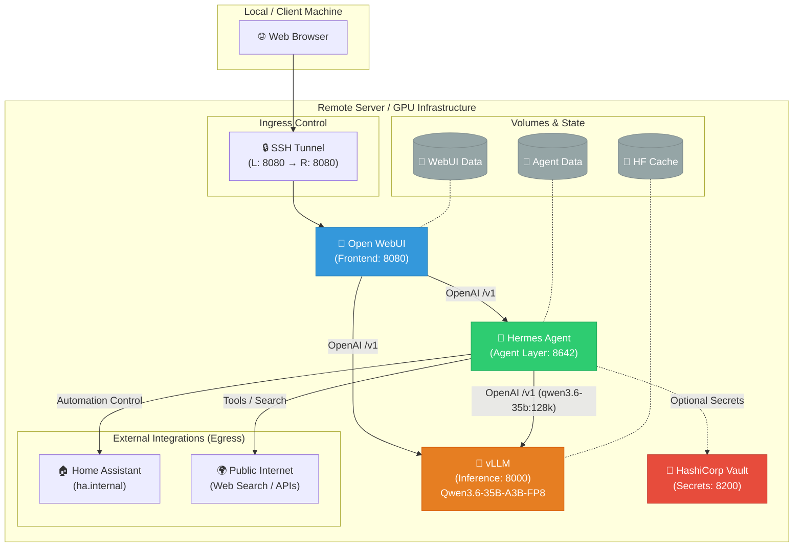

# Hermes Infrastructure Deployment

This repository contains the configuration and orchestration for the Hermes Agent environment, including local LLM inference, an agentic wrapper, and a user interface.

## 🏗️ Architectural Overview

The following diagram illustrates the infrastructure deployment, container relationships, and network flow (ingress/egress).



## 📦 Key Systems & Containers

| Service | Port | Image | Description |
| :--- | :--- | :--- | :--- |
| **Open WebUI** | `8080` | `ghcr.io/open-webui/open-webui` | Primary frontend for user interaction. |
| **Hermes Agent** | `8642` | `hermes-agent:latest` | The agentic engine handling tool use, memory, and task execution. |
| **vLLM** | `8000` | `scitrera/dgx-spark-vllm:0.14.1-t4` | Local LLM inference server, ARM64 + GB10 Blackwell pre-built. Serves `Qwen/Qwen3.6-35B-A3B-FP8` multi-aliased. |
| **Vault** | `8200` | `hashicorp/vault` | Secure storage for sensitive credentials (API keys, etc.). |

## 🌐 Ingress & Egress

### Ingress (How users connect)

Most published ports bind to `127.0.0.1` on the DGX host and require an **SSH tunnel** from the user's workstation. The exceptions are:

- **Open WebUI** on `0.0.0.0:8080` — primary user-facing UX, intentionally LAN-reachable.
- **vLLM** on `0.0.0.0:8001` — LAN-reachable for direct OpenAI-compat API access (`http://192.168.10.80:8001/v1/*`); vLLM has no built-in auth, so this implicitly trusts the LAN.
- **OpenClaw Caddy** on `0.0.0.0:443/80` and **openclaw-dashboard** on `0.0.0.0:9000` (sibling stack).

**One-shot tunnel:**

```bash
ssh -N \
  -L 8080:127.0.0.1:8080 \
  -L 4096:127.0.0.1:4096 \
  -L 8001:127.0.0.1:8001 \
  dgx-spark
```

**Recommended: put it in `~/.ssh/config` so `ssh dgx-spark` just works:**

```
Host dgx-spark
  HostName <dgx-ip-or-dns>
  User <user>
  LocalForward 8080 127.0.0.1:8080
  LocalForward 4096 127.0.0.1:4096
  LocalForward 8001 127.0.0.1:8001
  ExitOnForwardFailure yes
```

With the tunnel up:
- **Open WebUI**: http://localhost:8080 in a local browser (primary UX)
- **OpenCode API**: `curl -u opencode:$OPENCODE_PASSWORD http://localhost:4096/...`
- **vLLM** (optional, for `curl http://localhost:8001/v1/models` from laptop): http://localhost:8001

**Inspecting prototype output from the workstation:**
- `sshfs dgx-spark:/home/admin/code/hermes-config/prototypes ~/dgx-prototypes` (live browse)
- `rsync -av dgx-spark:/home/admin/code/hermes-config/prototypes/ ./prototypes/` (snapshot)
- Or open the folder via VS Code Remote-SSH

### Secrets

All credentials live in `.env` (gitignored) on the DGX host. Start from `.env.example`, then generate `HERMES_API_KEY` and `OPENCODE_PASSWORD` with `openssl rand -hex 32`.

### Internal API routing
- Open WebUI routes LLM requests to the Hermes Agent on port `8642` (inside the compose network).

### Egress (Where the system connects)
- **Home Assistant**: Hermes Agent connects to `ha.internal` for smart home control.
- **Inference**: Hermes Agent and OpenCode connect to vLLM via `http://vllm:8000/v1`.
- **HuggingFace**: vLLM downloads `Qwen/Qwen3.6-35B-A3B-FP8` weights on first boot (~37 GB). Cached afterward in the `vllm_hf_cache` volume.
- **Public Internet**: The Hermes Agent has egress capability for web search tools and external API calls.

## 💾 Data Persistence
- **Model Cache**: vLLM stores HuggingFace weights in the `vllm_hf_cache` volume; compiled CUDA graphs in `vllm_compile_cache`.
- **Legacy Ollama Models**: The `ollama_data` volume is preserved (orphaned) for one-week rollback after the 2026-04-25 vLLM cutover. Drop with `docker volume rm ollama_data` once the new stack is proven stable.
- **Agent State**: Persistent agent memory and logs are stored in the local `~/.hermes` directory, mapped to `/opt/data` in the container.
- **WebUI Data**: User accounts and chat histories are persisted in the `open-webui_data` volume.
