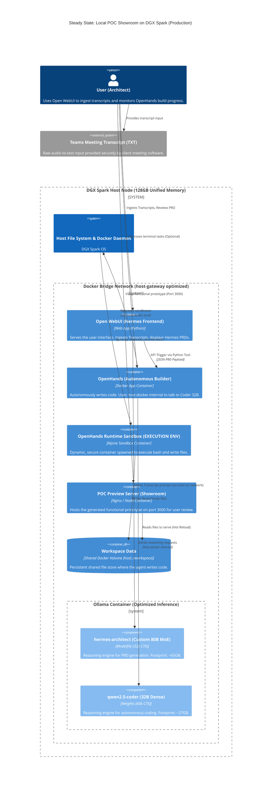

# Steady State: Local POC Showroom on DGX Spark (Production)

```mermaid
C4Component
  title Steady State: Local POC Showroom on DGX Spark (Production)

  Person(user, "User (Architect)", "Uses Open WebUI to ingest transcripts and monitors OpenHands build progress.")
  
  System_Ext(teams_transcript, "Teams Meeting Transcript (TXT)", "Raw audio-to-text input provided securely by client meeting software.")

  System_Boundary(spark_node, "DGX Spark Host Node (128GB Unified Memory)") {
    
    System(docker_daemon, "Host File System & Docker Daemon", "DGX Spark OS", "Manages the docker.sock API for container orchestration.")

    Boundary(docker_net, "Docker Bridge Network (host-gateway optimized)") {
        
        Container(open_webui, "Open WebUI (Hermes Frontend)", "Web App (Python)", "Serves the user interface. Ingests Transcripts, displays Hermes PRDs.")
        
        Boundary(ollama, "Ollama Container (Optimized Inference)") {
            Component(hermes_architect, "hermes-architect (Custom 80B MoE)", "Modelfile (32k CTX)", "Reasoning engine for PRD generation. Footprint: ~65GB.")
            Component(coder_32b, "qwen2.5-coder (32B Dense)", "Weights (64k CTX)", "Reasoning engine for autonomous coding. Footprint: ~27GB.")
        }
        
        Container(openhands_app, "OpenHands (Autonomous Builder)", "Docker App Container", "Autonomously writes code. Uses host.docker.internal to talk to Coder 32B.")

        Container(openhands_sandbox, "OpenHands Runtime Sandbox (EXECUTION ENV)", "Alpine Sandbox Container", "Dynamic, secure container spawned to execute bash and write files.")

        Container(poc_server, "POC Preview Server (Showroom)", "Nginx / Node Container", "Hosts the generated functional prototype on port 3000 for user review.")

        ContainerDb(workspace_volume, "Workspace Data", "Shared Docker Volume (host:./workspace)", "Persistent shared file store where the agent writes code.")
    }
  }

  %% Relationships
  Rel(user, teams_transcript, "Provides transcript input")
  Rel(user, open_webui, "Ingests Transcripts, Reviews PRD")
  Rel(user, openhands_app, "Approves terminal tasks (Optional)")
  Rel(user, poc_server, "Views functional prototype (Port 3000)")

  Rel(open_webui, hermes_architect, "Sends Transcript prompt (via internal network)")
  Rel(open_webui, openhands_app, "API Trigger via Python Tool", "JSON PRD Payload")

  Rel(openhands_app, coder_32b, "Sends reasoning requests", "host.docker.internal")
  Rel(openhands_app, coder_32b, "Sends reasoning requests", "host.docker.internal")
  Rel(openhands_app, docker_daemon, "Requests sandboxes", "var/run/docker.sock")
  Rel(docker_daemon, openhands_sandbox, "Spins up execution environment")
  
  Rel(openhands_sandbox, workspace_volume, "Writes React/Node files")
  Rel(poc_server, workspace_volume, "Reads files to serve (Hot Reload)")
```
